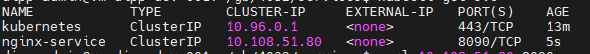
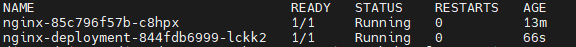
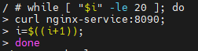

# Services Demo 

## Cluster IP Service Demo

- Create Cluster IP Deployment object

    `kubectl apply -f cluster-dep.yaml`

- Create Cluster IP Service object

    `kubectl apply -f cluster-demo.yaml`

- List all services

    ` kubectl get svc`
    

- Try accessing cluster IP service - You will not be able to access it.

    `curl 10.108.51.80:8090`

- Lets try accessing a pod

    `kubectl get pods`

    

- Exec into the pods - You will be able to access using curl command

    ```
    kubectl exec -it nginx-deployment-844fdb6999-lckk2 -- sh
    curl 10.108.51.80:8090
    curl nginx-service:8090
    ```

- Forwarding port and access cluster service

    `kubectl port-forward service/nginx-service 8083:8090`
    
- To check load balancing add the following code by entering into one of the pods
    

- Start watching the two replics using logs command

    `kubectl logs <podsname> -f`


## NodePort Demo

- Apply node port service yaml file 

    `kubectl apply -f services/nodePort-demo.yaml`

- Get Services - You should see the new nfix nodePort service

    `kubectl get svc`

- Get minikube profiles 

    `minikube profile list`

- Get the IP address and access the service at <ip>:30000

    `minikube ip -p <cluster-name>`

- You can also access the service using minikube service command

    `minikube service nginx-service -p <clustername>`

## Load Balancer Demo

**On minikube since there is no load balancer service if the type is set to LoadBalancer the service will still use NodePort option.** 

- Apply the Load balancer yaml file 

    `kubectl apply -f services/loadbalancer-demo.yaml`

- Get Services - You should see the new nginx Loadbalancer service

    `kubectl get svc`

## Ingress Demo

We will use Kubernete Tutorial [here](https://kubernetes.io/docs/tasks/access-application-cluster/ingress-minikube/) to run the ingress demo. 